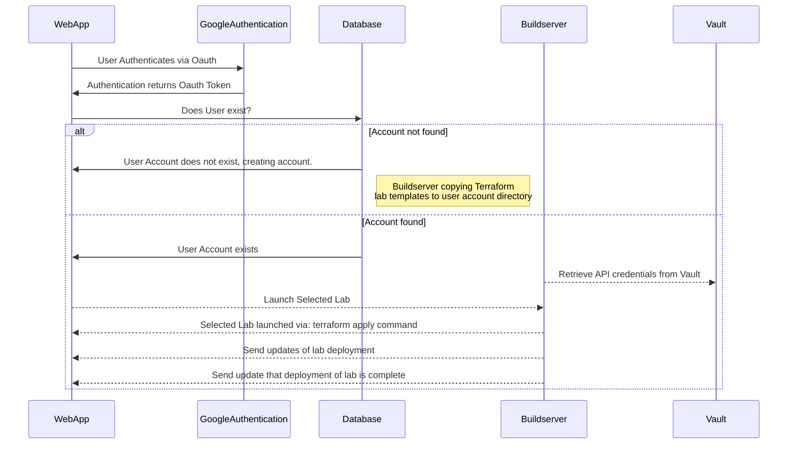

# API Flow 

This document stipulates the workflow responsibilities taken at each step at a high level ladder diagram between the three components of the system:

* Web Application Server
* Buildserver
* Database

## Application Workflow

1. User authenticates on internal web page
1. Once authenticated user account on local database is created or current account has login process logged
1. If first login, create user hash for ID and store Oauth2 token in account
1. Welcome screen presented
1. User chooses a lab to launch
1. Web server API communicates with a backend API that will tell our buildserver to launch the required lab via terraform
1. This includes setting up internal authentication using Vault for system Proxmox API secrets
1. Proxmox API communicates with Web Application API showing progress deploy meter (metrics can be gathered internally from Promox API and shared via API)
1. Buildserver API will issue a terraform apply command. This requires individual directories per user  and sub-directories per each lab to be created We would pre-create this upon account creation. 
1.	Once application is deployed tutorial steps and screen will come up
  i. Session is logged in the database
1.	Upon completion of the lab (submit button is hit) and grading script grades the lab – value stored in
1.	Upon FINISH/RESET button being hit Web application API will trigger buildserver API to issue terraform destroy command

[Mermaid Sequence Diagram Documentation](https://mermaid.js.org/syntax/examples.html#sequence-diagram-blogging-app-service-communication "Webpage for Mermaid Sequence Diagram Documentation")

## API sequence diagram

